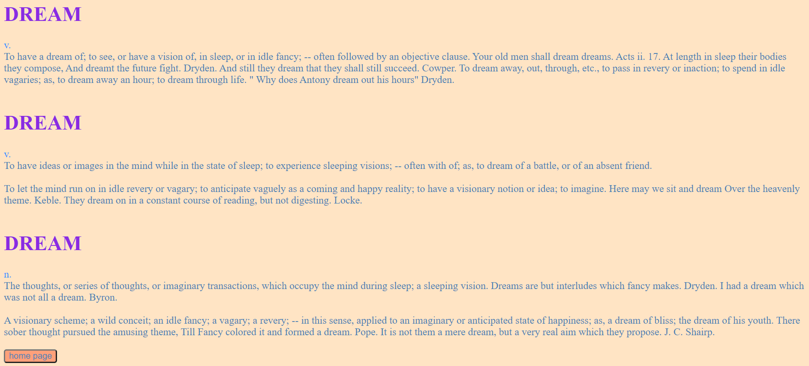
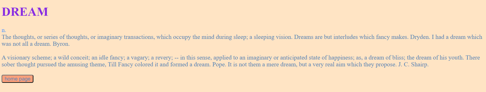
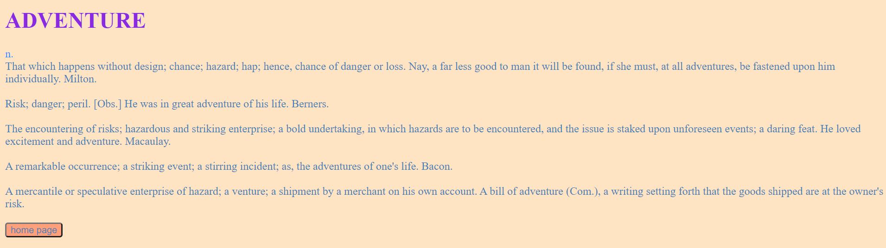

# dictionary-front

App url: `https://dictionaryreactbucket.s3.eu-central-1.amazonaws.com/index.html` (press the home page button)

***An english-english dictionary app with 3 searching options***

The app has four routes:

1. Home page on `/` - provides navigation in the app:

2. Search by word on `/:word` - displays all the definitions for the given word.
example for `/dream`:

3. Search by word and part of speech on `/:word/:partOfSpeech` - displays all the definitions for the given word from the given part of speech.
example for `/dream/Noun`:

4. Get a random word by part of speech and optional word beginning on `/part-of-speech/:part?letter={}` - displays a random word definition from the given part of speech that begins with the given word beginning.
example for `/part-of-speech/Noun?letter=ad`:

***At all routes every word of every definition is clickable and by click will display the difinitions for that word***
